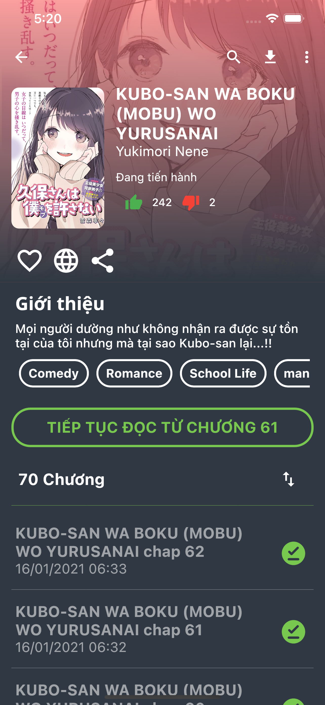
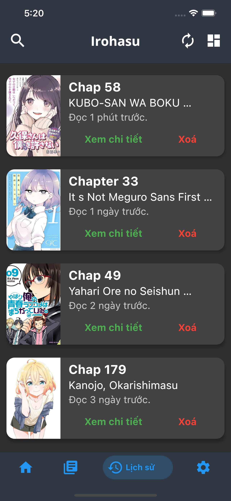

## **Irohasu - Learn Flutter**

# About

Building a manga reader app on the process of learning bloc. Project unfinished.

The API is still in development.

# Future

- Manga list (infinite scroll).
- Switch theme [white, dark, black] or system as the default.
- Bookmarks Manga.
- Check history reading.
- Advanced search manga.
- Read chapter vertically or horizontally.
- Download manga and read offline.
- Webview.

# Demo

# Code Dependencies

If you wish to run this code on your local machine, Flutter needs to be installed.

See instructions [here](https://flutter.dev/docs/get-started/install "here") for your operating system.

# Disclaimer

The developer of this application does not have any affiliation with the content providers available.
