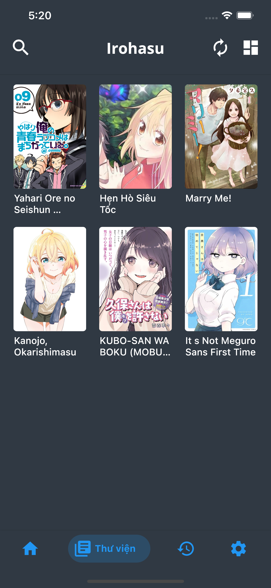
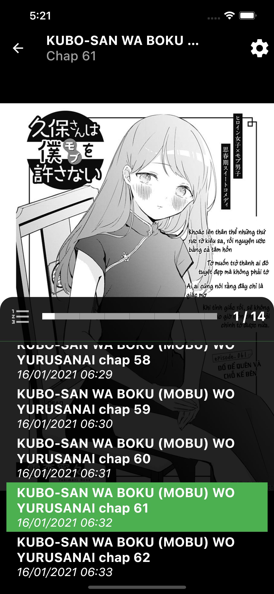

## The project is in the process of being revised

## **Irohasu - Learn Flutter**

# About

Building a manga reader app on the process of learning bloc. Project unfinished.

# Demo

|             Library Screen             |               History Screen                |             Detail Screen              |
| :------------------------------------: | :-----------------------------------------: | :------------------------------------: |
|  |  | |

|             Search Screen             |           Vertically Screen            |          Horizontally Screen           |
| :-----------------------------------: | :------------------------------------: | :------------------------------------: |
|  |  |  |

## Getting Started

Once you have added the annotations to your code you then need to run the code generator to generate the missing `.g.dart` generated dart files.

```shell
# Run
$ flutter run --dart-define=API_KEY=PUT_YOUR_API_KEY_HERE

# Build
$ flutter build --dart-define=API_KEY=PUT_YOUR_API_KEY_HERE

# Code Dependencies

If you wish to run this code on your local machine, Flutter needs to be installed.

See instructions [here](https://flutter.dev/docs/get-started/install "here") for your operating system.

# Disclaimer

The developer of this application does not have any affiliation with the content providers available.
